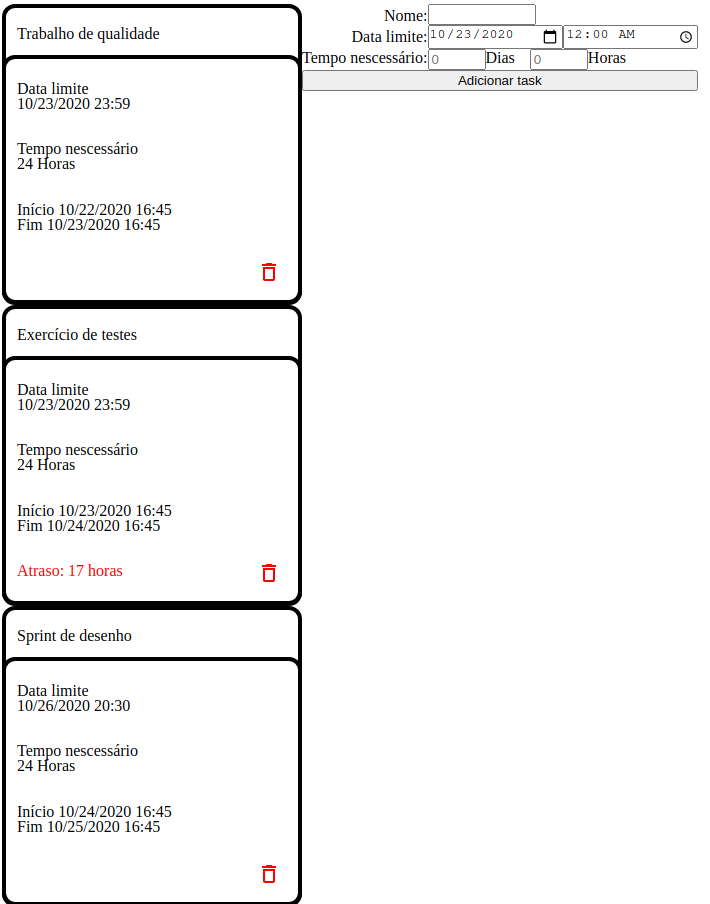

# [Greed AutoPlanner](https://projeto-de-algoritmos.github.io/Greed_Auto_Planner/)

**Número da Lista**: 3<br>
**Conteúdo da Disciplina**: Greed<Xbr>

## Alunos
|Matrícula | Aluno |
| -- | -- |
| 17/0102343  |  Eduardo Vieira Lima |
| 17/0109208  |  Luis Henrique Pereira Taira |

## Sobre 
Organizador de tarefas que ordena as tarefas automáticamente para ter o mínimo atraso possível

## Screenshots



### Pré requisitos
Ter instalado um navegador de internet.

## Instalação 
**Linguagem**: javascript<br>

* Abrir o arquivo index.html em um navegador (arrastar o arquivo para uma janela de navegador aberta
* Ou rodar na raiz do projeto
```
$ python -m http.server 8080
```
ou usar qualquer servidor http de sua preferência.
* Ou usar o deploy clicando [aqui](https://projeto-de-algoritmos.github.io/Greed_Auto_Planner/)

## Uso 
* Criar múltiplas tarefas preenchendo todos os campos

## Outros 
Foi usado o algorítimo de minimização de atraso.
